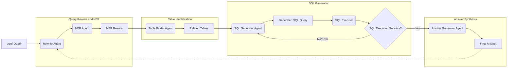

# zhipu-2024

该项目旨在完成 [2024金融行业·大模型挑战赛](https://competitions.zhipuai.cn/matchDetail?id=120241202000000003)，排名为 62/207(25%)。该任务是通过处理用户多轮问询生成对应的 sql 语句进而响应用户的 text2sql 类任务，基于此，解决方案的 pipeline 为：



### 解释（Explanation）

+ Rewrite Agent:
    + 输入: user query + previous user query(ies) and their corresponding answer(s)
    + 输出: rewrited user query with all specified information
    + 例子: `该公司当天的收盘价是多少？`
        ```json
        阿里巴巴在6月8日的收盘价是多少？
        ```
+ NER Agent：
    + 输入：rewrited user query
    + 输出：JSON 格式的 NER 结果
    + 例子： `600872的全称、A股简称、法人、法律顾问、会计师事务所及董秘是？`
        ```json
        {
            "reasoning_process_cot": "根据查询内容，'600872' 是一个股票代码，指向了一个上市公司，因此应该识别为一个代码。而'全称'、'A股简称'、'法人'、'法律顾问'、'会计师事务所'和'董秘'并没有出现在查询内容中，所以无需识别它们为实体。",
            "result": [
                {
                    "代码": "600872"
                }
            ]
        }
        ```
+ Table Finder Agnet:
    + 输入：rewrited user query + NER results
    + 输出：匹配到的最相关的 sql table(s)，JSON 格式
    + 例子：`600872的全称、A股简称、法人、法律顾问、会计师事务所及董秘是？`
        ```
        {
            "raw_question": "600872的全称、A股简称、法人、法律顾问、会计师事务所及董秘是？",
            "data_source_reasoning": [
                {
                    "step_1": "解析输出格式要求",
                    "result": "问题没有对回答格式或数据结构提出特定要求，因此无需进行额外的格式或精度处理。"
                },
                {
                    "step_2": "抽象化问题的信息意图",
                    "cot_thinking": "用户的问题是询问某A股公司的全称、A股简称、法人、法律顾问、会计师事务所及董秘信息。",
                    "result": [
                        "A股公司的全称",
                        "A股简称",
                        "法人",
                        "法律顾问",
                        "会计师事务所",
                        "董秘"
                    ]
                },
                {
                    "step_3": "定位所有的相关表格（需求1：A股公司的全称和简称）",
                    "cot_thinking": "查看 Database-Table Schema，A股公司的全称和简称与'证券主表' (SecuMain) 表相关。该表记录A股单个证券品种的简称、中英文名称、上市交易所、上市状态等基础信息，因此适合用于查询A股公司的全称和简称。"
                },
                {
                    "step_4": "定位所有的相关表格（需求2：法人、法律顾问、会计师事务所及董秘）",
                    "cot_thinking": "查看 Database-Table Schema，法人、法律顾问、会计师事务所及董秘信息与'公司概况' (LC_StockArchives) 表相关。该表收录上市公司的基本情况，包括联系方式、地址邮编、注册信息、中介机构、行业和产品、公司证券品种及背景资料等内容，因此适合用于查询法人、法律顾问、会计师事务所及董秘信息。"
                },
                {
                    "step_5": "结论",
                    "identify_database": "查看 Database-Table Schema，SecuMain 在'常量库'（ConstantDB）数据库中；LC_StockArchives 在'上市公司基本资料'（AStockBasicInfoDB）数据库中。",
                    "cot_thinking": "综上所述，要回答这个问题，我们需要查询 ConstantDB 数据库中的 SecuMain 表，获取A股公司的全称和简称。然后，再查询 AStockBasicInfoDB 数据库中的 LC_StockArchives 表，获取法人、法律顾问、会计师事务所及董秘信息。"
                }
            ],
            "data_source": [
                {
                    "question": "600872的全称和A股简称是什么？",
                    "database": "ConstantDB",
                    "table": "SecuMain"
                },
                {
                    "question": "600872的法人、法律顾问、会计师事务所及董秘是谁？",
                    "database": "AStockBasicInfoDB",
                    "table": "LC_StockArchives"
                }
            ]
        }
        ```
+ SQL Generator Agent:
    + 输入：user query + table finder resutls + NER results
    + 输出：SQL query，JSON 格式
    + 例子：`600872的全称、A股简称、法人、法律顾问、会计师事务所及董秘是？`
        ```
        {
            "query": "600872的全称、A股简称、法人、法律顾问、会计师事务所及董秘是？",
            "sql_cot_reasoning": "首先，我们需要从数据库中查询与股票代码600872相关的信息。根据背景知识，我们知道股票代码600872对应的CompanyCode为1805。我们需要从LC_StockArchives表中获取以下字段的信息：ChiName（公司全称）、AShareAbbr（A股简称）、LegalRepr（法人代表）、LegalConsultant（法律顾问）、AccountingFirm（会计师事务所）和SecretaryBD（董事会秘书）。因此，我们可以通过WHERE子句筛选CompanyCode为1805的记录，并选择上述所需字段。",
            "sql_query": "SELECT ChiName, AShareAbbr, LegalRepr, LegalConsultant, AccountingFirm, SecretaryBD FROM AStockBasicInfoDB.LC_StockArchives WHERE CompanyCode = 1805",
            "sql_res": [
                {
                    "ChiName": "中炬高新技术实业(集团)股份有限公司",
                    "AShareAbbr": "中炬高新",
                    "LegalRepr": "余健华",
                    "LegalConsultant": "广东卓建(中山)律师事务所",
                    "AccountingFirm": "天职国际会计师事务所（特殊普通合伙）",
                    "SecretaryBD": "郭毅航"
                }
            ]
        }
        ```
+ Answer Generator Agent：
    + 输入：user query + sql results + previous user query(ies) and their corresponding answer(s)
    + 输出：中文问题回复，plain text
    + 例子：`600872的全称、A股简称、法人、法律顾问、会计师事务所及董秘是？`
        ```
        股票代码为600872的公司是中炬高新技术实业(集团)股份有限公司（A股简称：中炬高新），其法人代表为余健华，法律顾问是广东卓建(中山)律师事务所，会计师事务所为天职国际会计师事务所（特殊普通合伙），董秘是郭毅航。
        ```

### 设计依据 (Justification)

* **为何采用固定工作流 (Fixed Workflow) 而非完全自主的 Agent 系统？**
    * **初期构想与挑战：** 项目最初构想采用类似自主研究 (Deep Research) 的模式，设计模块化工具后，由一个 Planner Agent 根据任务进度动态决策。然而，初步实验（基于 GLM-4）表明，模型的自主决策和反思能力尚有局限，尤其在需要深度反思以修正错误时，可能消耗大量 Token 且效率不高，难以满足实际应用需求。
    * **决策因素：** 综合考量大语言模型（LLM）的实际表现、Token 成本以及开发复杂度，采用预定义的、结构化的工作流 (Workflow) 对任务进行分解，成为更务实和可靠的选择。

* **如何处理多轮对话？**
    * **挑战：** 在固定工作流模式下，维持一个跨越多个独立 Agent 调用的完整对话会话状态较为复杂。核心挑战在于如何在不同处理阶段间有效传递历史对话信息。
    * **解决方案：** 本项目采用了简化策略，即将多轮对话上下文（用户历史查询及对应的系统回答）整合到当前轮次的输入中，有效**将多轮对话转化为单轮处理任务**。`Rewrite Agent` 负责处理这一转化。这种方法简化了后续所有 Agent 的设计，使其只需关注当前轮次的输入即可。

* **为何需要 `Rewrite Agent`？直接使用原始用户查询不行吗？**
    * **必要性：** 不可以。本项目需要支持多轮对话交互。在多轮对话中，首轮查询通常包含明确的实体信息（如公司名称、日期）。但在后续轮次中，用户常使用指代词（如“该公司”、“那天”）。`Rewrite Agent` 的核心职责是解析当前用户查询，并结合历史对话上下文，生成一个信息完整、无歧义的查询，供下游 Agent 使用。

* **为何需要独立的 `NER Agent`，而不是将其功能整合到 `Table Finder Agent` 中？**
    * **实验对比：** 最初尝试将命名实体识别 (NER) 功能嵌入 `Table Finder Agent`。实验发现，这种集成方式影响了实体识别的准确率。将 NER 任务独立为一个专门的 `NER Agent` 后，实体识别准确率显著提升至接近 99%，几乎无错误。
    * **结论：** 这表明，即使在当前（以 2025 年初为参考）的 LLM 技术水平下，采用**单一职责原则**设计 Agent（即每个 Agent 专注于一个特定任务）仍然比构建多任务的复杂 Agent 更有效。这也与当前 AI Agent 领域的普遍共识一致。

* **为何 SQL 执行错误时，流程仅返回 `SQL Generator Agent` 而非 `Table Finder Agent`？**
    * **简化设计：** 当前工作流中的错误处理是一个简化版本。在理想情况下，如果 SQL 执行失败的根本原因是数据表选择错误，流程应回溯到 `Table Finder Agent` 进行修正。
    * **实际考量：** 当前设计优先处理 SQL 语句生成错误的可能性，将流程指回 `SQL Generator Agent` 进行重试。这是一个在简化实现和理想效果之间的权衡。在未来的迭代中，可以引入更复杂的错误分析和回溯机制。

* **何时判定 SQL 查询执行错误？**
    * **判定标准：** 当 `SQL Executor` 执行生成的 SQL 查询后，如果数据库连接失败、SQL 语法错误导致无法执行，或者查询成功执行但返回**空结果集**时，均判定为 SQL 执行错误。

* **SQL 查询的具体纠错流程是怎样的？**
    * **挑战：** 由于 SQL 在云端执行，API 返回的错误信息通常有限，不足以为 LLM 提供精确的错误定位和修复指导。因此，纠错过程很大程度上依赖模型的自我修正能力。
    * **方法探索：** 初期尝试使用引导性 Prompt（例如：“当前 SQL 执行错误，请逐步反思并生成修正后的 SQL 查询”）。但这种方式难以稳定保证模型输出符合预期的 JSON 格式，导致难以自动化提取修正后的 SQL。
    * **最终方案：** 经过多次对比实验，发现引导模型进行反思并生成修正查询，与直接要求模型根据原始需求重新生成查询，两者达到正确结果所需的交互次数相近。然而，**直接重新生成消耗的 Token 更少**。因此，最终选择放弃复杂的反思步骤，在检测到 SQL 执行错误后，直接触发 `SQL Generator Agent` 重新生成查询。

### 讨论 (Discussion)

* **JSON 输出格式对模型能力的潜在限制：**
    * **观察：** 尽管在 Prompt 中要求 LLM 遵循严格的 CoT (Chain-of-Thought) 流程进行思考并输出 JSON 格式结果，但在某些复杂场景下，模型的表现并不理想。对比测试发现，放宽对输出格式的限制（例如允许输出 Markdown 格式）有时能提高模型处理边缘案例 (Bad Case) 的成功率。
    * **反思：** 最初选择 JSON 格式是为了便于程序自动解析和处理模型输出，避免额外的数据清洗步骤，并预期当前 LLM 技术已能成熟处理格式约束。然而，实践表明，**强制的结构化输出（如 JSON）有时可能会牺牲模型在特定任务上的部分推理或表达能力**。这是一个在易用性与模型性能之间的权衡。

* **如何将当前设计演进为全自动 Agent 系统？**
    * **改进思路：** 可以引入一个**中心 Planner Agent** 负责整体任务规划和调度。将现有的各个 Agent（Rewrite, NER, Table Finder, SQL Generator, Answer Generator）封装为可调用的工具 (Functions/Tools)。引入**反思 (Reflection) 模块**，用于评估工具执行结果。
    * **架构模式：** 整体架构可参考 **ReAct (Reasoning and Acting)** 模式：Planner Agent 进行思考 (Reason)，决定调用哪个工具 (Act)，获取工具执行结果（Observation）后，结合 Reflection 模块的评估进行下一步思考或行动。这需要利用 LLM 的 Function Calling 能力。

* **模型推理缓存 (Cache) 对结果的潜在影响：**
    * **现象：** 在使用 GLM-4 进行推理时，观察到在某些时间段内，模型输出行为异常（例如，似乎不完全遵循 Prompt 指令），但却能意外产生正确结果。
    * **推测：** 怀疑这与模型服务提供方可能启用的**共享缓存机制 (Cache Pool)** 有关。如果在特定时间段内，大量用户提交的 Prompt 包含相似内容（例如，相同的数据库 Schema），共享缓存可能被“污染”，导致个别用户的特定指令（如输出格式要求）被覆盖。
    * **潜在风险：** 如果缓存池是公共而非用户隔离的，可能存在安全隐患。攻击者或可通过高并发提交特定内容的 Prompt 来操纵公共缓存，进而影响或扭曲其他用户的模型响应。

* **中英文 CoT 对 SQL 生成质量的影响：**
    * **观察：** 实验发现，在生成 SQL 时，引导模型使用**英文进行 CoT 推理**，相较于使用中文 CoT，生成的 SQL 查询质量和准确率更高。
    * **可能原因：** 推测这主要源于 LLM 的训练数据分布，即模型在处理英文技术指令和代码生成方面可能接受了更充分的训练。

* **解决 LLM 在长文本上下文学习 (In-Context Learning, ICL) 中的理解准确性问题：**
    * **挑战：** 在对 GLM、DeepSeek、GPT-4o 等模型的测试中发现，当 Prompt 包含大量数据库 Schema 信息（长文本）时，即使查询意图明确指向某个特定表格，LLM 有时也无法准确定位。
    * **解决方案：** 实验表明，**缩短提供给模型的上下文长度**能有效提升其理解和定位的准确性。因此，采用 **RAG (Retrieval-Augmented Generation)** 结合**关键词匹配**的策略来检索和筛选最相关的少数 Table Schema，作为精简后的上下文提供给 `Table Finder Agent`，从而提高其表现。

* **LLM 在区分语义相近或物理相邻的 Table Schema 时的困难：**
    * **现象：** 在 GLM 和 DeepSeek 模型中均观察到，当两个表的 Schema 在文档中物理相邻，且用户查询与其中一个（例如 Table B）相关时，即使模型的 CoT 推理过程看起来正确，最终定位结果有时会错误地指向相邻的 Table A。
    * **挑战与对策：** 这个问题难以通过简单修改 CoT Prompt 来稳定解决。最终有效的策略是将 Schema 文档中相邻的、易混淆的表的描述**物理分开**，增大它们在上下文中的距离。
    * **可能解释：** 推测原因可能在于 LLM 进行长文本 ICL 时，其内部的**注意力机制习得的关联性与真实的语义关联性存在偏差**。这种偏差可能源于模型对相似语义的混淆，或是其 ICL 能力本身的局限，未能完全精确地理解长上下文中的细微差别和边界。

* **精调 CoT Prompt 的收益：**
    * **效果：** 实践证明，仔细设计和迭代优化 CoT Prompt 对于提升 Agent（尤其是 `Table Finder Agent`）的性能、减少 Bad Case 至关重要。通过精调，预计 `Table Finder Agent` 的准确率可达到 80%-90% 的水平。
    * **方法论：**
        * **结构：** 构造 Prompt 时，通常采用“指令 (Instruction) + 少量示例 (Few-shot Examples) + 当前用户查询 (User Query)”的结构。
        * **迭代逻辑：**
            1.  观察目标 LLM（如 GLM）自身的逻辑思考特点和偏好。
            2.  修改 Few-shot 示例中的 CoT 过程和措辞，使其风格与模型偏好保持一致。
            3.  根据出现的 Bad Case，针对性地调整 Instruction 中的规则描述或 Few-shot 示例的内容。
            4.  在必要时，增加规则约束或增加 Few-shot 示例的数量。
